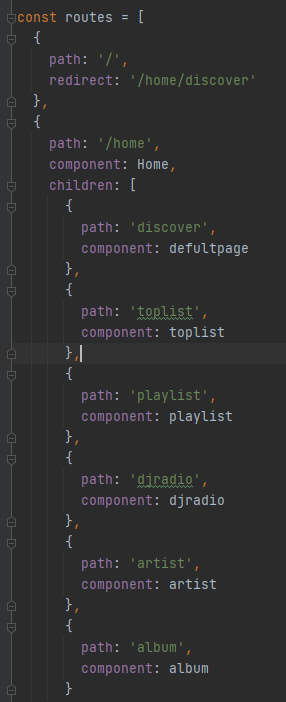
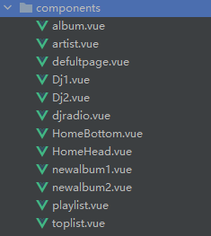
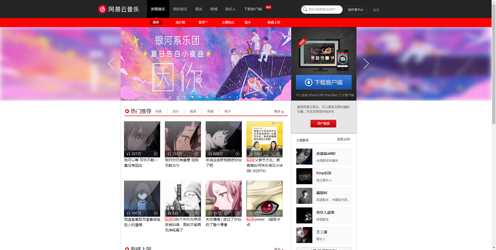
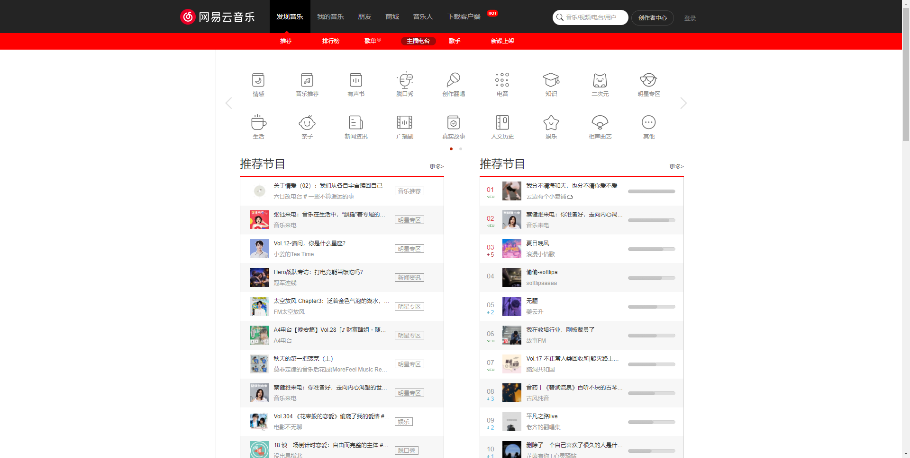
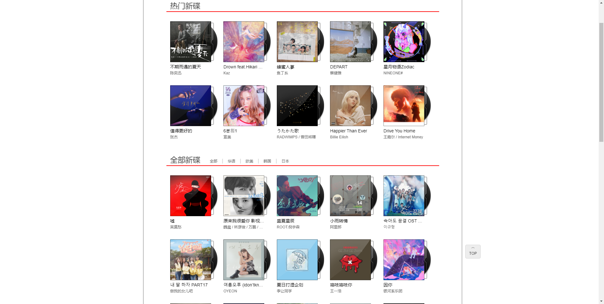

# 用vuejs仿网易云音乐
***
在做完前两个基础的静态页面后，复习了一遍css基础决定写一个非静态页面来巩固之前学的vue全家桶，花了差不多半个月
时间来大概完成这个网易云小项目。
## 技术栈
***
* vue+vue-router(核心)
* axios(处理请求)
* vuex(全局数据流传输)
* bootstrap(响应式框架)
* animate(处理简单动画效果)
## 功能分析与设计
***
为了尽可能的与官网相同，采用的GitHub上已经写好的后端api当作此项目的请求接口
> https://github.com/Binaryify/NeteaseCloudMusicApi

vuejs部分

路由结构如下

组件部分

附上界面效果图

## 功能部分
***
由于时间的紧迫，部分功能并未完全开发完毕，会在之后的时间慢慢完成

推荐页面（✔）

排行榜（✔）

歌单（✔）

主播电台（✔）

歌手（✔）

新碟上架（✔）

播放（❌）

搜索（❌）

私信（❌）

登录（❌）

需要改进的有很多，请大家可以多提提意见。后续我会不断改进，如果觉得还可以，请star，你们的star是我前进的动力。
